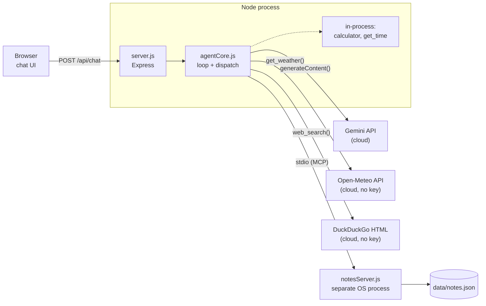
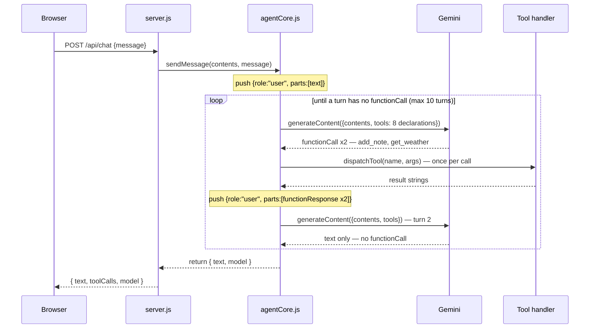
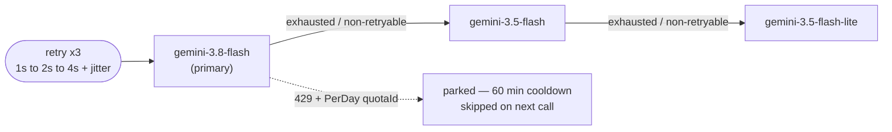
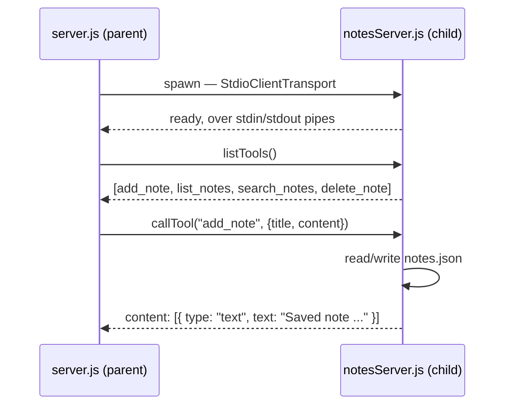

# ai-agent-gemini

A Node.js AI agent that combines direct API calls, web search, and MCP tool calling in one agentic loop — with **nothing that requires a paid key**:

| Piece | Backend | Cost |
|---|---|---|
| LLM | [Google Gemini API](https://aistudio.google.com/apikey) (`gemini-3.8-flash`, auto-falls back to `gemini-3.5-flash` / `gemini-3.5-flash-lite`) | Free tier, free API key, no credit card |
| Web search | DuckDuckGo HTML scrape | Free, no key at all |
| Direct API tool | Open-Meteo weather API | Free, no key at all |
| MCP server | Your own `notesServer.js`, run locally | Free, no key at all |

## Setup

Requires **Node 20+** (the Gemini SDK's HTTP layer needs a Node version with a native `File` global).

```bash
npm install
cp .env.example .env
```

Get a free key at [aistudio.google.com/apikey](https://aistudio.google.com/apikey) (Google account, no billing required) and put it in `.env`:

```
GEMINI_API_KEY=AIza...
```

## Run

```bash
npm start
# or with your own prompt:
node src/agent.js "Save a note about today's standup, then search the web for the current Node.js LTS version"
```

Or run the web chat UI instead:

```bash
npm run ui
```

Then open `http://localhost:3000`. It's an Express server ([server.js](server.js)) serving a small chat frontend ([public/](public)) — same agent underneath, shows tool calls inline as it makes them, keeps one conversation in memory (reset with the UI's button or `POST /api/reset`).

While developing the server, use the hot-reload variant instead — Node's built-in `--watch` restarts it automatically whenever `server.js` or anything under `src/` changes (edits to `public/*` never needed a restart; Express serves those fresh from disk every request):

```bash
npm run ui:dev
```

## Model fallback and retry

Gemini's free tier can return `503 UNAVAILABLE` (overloaded) or `429 RESOURCE_EXHAUSTED` (rate limit / quota). [`src/geminiRetry.js`](src/geminiRetry.js) handles both automatically:

- **Retries with exponential backoff** (up to 3 retries, ~1s/2s/4s + jitter, or the server's own suggested delay when it gives one) on transient errors (429, 500, 502, 503, 504) before giving up on a model.
- **Falls back to the next model** in the list — `GEMINI_MODEL` (default `gemini-3.8-flash`) → `gemini-3.5-flash` → `gemini-3.5-flash-lite` — once a model's retries are exhausted, or immediately on a non-retryable error (e.g. 404 if a model name gets deprecated).
- **Recognizes a daily-quota 429 specifically** (newer/limited-preview models can have a free tier as low as ~20 requests/day) and skips straight to the next model with zero wasted retries, then parks that model in a 1-hour cooldown so later calls don't even attempt it until the cooldown passes.
- **Sticky**: once a fallback model succeeds, later turns start from that model instead of re-trying an overloaded/exhausted primary on every single message. Resets to the top of the list once every model in it has failed (the cooldown still protects daily-exhausted ones from being retried too soon).

You'll see this in the console as `[gemini] ... retrying in ...` / `... falling back to ...` / `... parking it for ...` / `... skipped — ... cooling down ...` lines.

## Implementation notes

- **LLM client**: [`@google/genai`](https://www.npmjs.com/package/@google/genai). Gemini's function-calling message shape puts tool results back as a `user`-role turn with `functionResponse` parts, with no per-call `id` — see [`src/agentCore.js`](src/agentCore.js).
- **Tool schema**: Gemini wants JSON Schema with uppercase type names (`STRING`, `OBJECT`, ...) and rejects empty `properties: {}` on no-arg tools. [`src/schemaAdapter.js`](src/schemaAdapter.js) converts our plain JSON Schema tool defs to that shape.
- **Web search**: Gemini's native Google Search grounding tool isn't guaranteed to be free on every account tier, so this uses a keyless DuckDuckGo scrape instead — see [`src/tools/webSearch.js`](src/tools/webSearch.js).
- **MCP server and direct API tool are plain MCP / JSON-Schema**, not tied to any specific LLM provider — `notesServer.js` and `get_weather` would work unchanged behind a different LLM client.

## Agent internals

How a chat message actually becomes a tool call, end to end — one Node process, four outside
components, and a loop that keeps running until Gemini stops asking for help.

### The system, at a glance

One Node process (`server.js` + `agentCore.js`) sits in the middle. It talks to four outside
things: the Gemini API, two plain REST APIs, and its own MCP tool server running as a
**separate OS process**.



`notesServer.js` is the only component that is a genuinely separate operating-system process,
spawned and talked to over stdio pipes. Every other "tool" is just a function call inside the
same Node process.

### One message's journey

Traced against a real exchange: *"Save a note titled demo-ui with content it works, then get
the weather in Mumbai."* Gemini answered that in two turns — one turn where it asked for two
tools at once, and a second turn where it had everything it needed and just replied.



The whole exchange is one HTTP request from the browser's point of view — the multi-turn
conversation with Gemini happens entirely inside that single `/api/chat` call.

### How the agent decides which tool to call

The honest answer: **it doesn't, here.** There is no `if` statement anywhere in this codebase
that reads "weather" and calls `get_weather`. Every turn, `agentCore.js` sends Gemini the
*entire* tool catalog — all 8 tools, every time, regardless of what the user asked — plus the
conversation so far. Gemini's own model weights do the matching between the user's words and
the tool descriptions. Our code only finds out which tool was picked after Gemini has already
decided, by reading the `name` field off the response.

```mermaid
flowchart LR
    subgraph Catalog["Sent every turn, unconditionally"]
        direction TB
        t1[calculator]
        t2[get_time]
        t3[get_weather]
        t4[web_search]
        t5[mcp__notes__add_note]
        t6[mcp__notes__list_notes]
        t7[mcp__notes__search_notes]
        t8[mcp__notes__delete_note]
        hist["+ full conversation history"]
    end

    Catalog --> Gemini{{"Gemini<br/>reasoning — opaque to us"}}

    Gemini -->|"no tool needed"| Text["plain text reply"]
    Gemini -->|"tool needed"| FC["functionCall part(s)<br/>{ name, args }"]
    FC --> Dispatch["dispatchTool()<br/>our code starts here"]
```



Two things fall out of this that are easy to miss:

- A single turn can return *multiple* `functionCall` parts at once — that's exactly what
  happened above, where `add_note` and `get_weather` came back together. `agentCore.js` just
  loops over whatever array it got and runs each one.
- Because the full catalog is sent every time, adding a ninth tool (another MCP server, another
  REST API) changes nothing about "how decisions get made" — it just grows the list Gemini is
  choosing from. See [`src/mcp/config.js`](src/mcp/config.js) for where that list grows.

### Dispatch: turning a name into code

Once Gemini has named a tool, `dispatchTool(name, args)` in `agentCore.js` still has to find the
actual function. This part genuinely is ours — a plain name lookup, no reasoning involved.

| Gemini names… | `dispatchTool` checks… | Which runs… |
|---|---|---|
| `mcp__notes__*` | `mcp.isMcpTool(name)` — true if the name starts with the `mcp__` prefix a connected server registered | routes over stdio to `notesServer.js` |
| `calculator`, `get_time` | `localToolNames.has(name)` — a `Set` built once at startup from `localTools.js` | runs in-process, no I/O |
| `get_weather` | `directApiToolNames.has(name)` | `fetch()` to Open-Meteo |
| `web_search` | `webSearchToolNames.has(name)` | scrapes DuckDuckGo's HTML results |

Checked in that order, first match wins; an unrecognized name throws — which can only happen if
a tool declaration and its handler drift out of sync, not from anything the user typed.

### Model fallback, visually

The bullet points above, as a picture: a daily-quota `429` skips retries entirely and parks that
model for an hour; anything else retryable gets up to 3 retries with backoff before falling
through.



"Sticky" means a conversation that has already fallen back doesn't keep re-trying the
overloaded primary on every single message — only the very first failure pays the retry cost.

### MCP: the agent's own tool server

`notesServer.js` isn't special-cased anywhere — it's a real MCP server, spoken to over the same
protocol a third-party MCP server would use. It happens to be one we wrote.



This is the same `listTools()` / `callTool()` exchange that populated the tool declarations
above — the MCP protocol is what lets `agentCore.js` treat a tool it didn't hard-code exactly
like one it did. Talking to `notesServer.js` over stdio instead of just importing its functions
is what makes swapping in a real third-party MCP server (filesystem access, a database, Slack) a
one-line change in [`src/mcp/config.js`](src/mcp/config.js), not a rewrite.

## Project layout

```
server.js                   # Express backend for the web chat UI
public/                     # chat UI frontend (plain HTML/CSS/JS, no build step)
src/
  agent.js                  # CLI entrypoint
  agentCore.js               # shared agent loop — used by both agent.js and server.js
  geminiRetry.js              # retry + exponential backoff + model fallback
  schemaAdapter.js             # JSON Schema -> Gemini functionDeclarations
  tools/
    localTools.js              # calculator, get_time
    directApi.js                # get_weather (Open-Meteo, no key)
    webSearch.js                 # DuckDuckGo scrape (no key)
  mcp/
    config.js                    # MCP servers to spawn/connect to
    client.js                     # MCP client: connects, lists tools, dispatches calls
    servers/
      notesServer.js               # your own MCP server (add/list/search/delete notes)
data/
  notes.json                      # created at runtime by the notes MCP server
```

## Swapping in a different free LLM

If you'd rather run fully local with no cloud account at all, swap `src/agent.js`'s Gemini client for [Ollama](https://ollama.com) (`POST http://localhost:11434/api/chat` with a `tools` array in OpenAI function-calling format, using a tool-capable model like `llama3.1` or `qwen2.5`). The rest of the project — MCP client/server, direct API tool, web search — stays exactly the same; only the LLM call and response parsing change.
